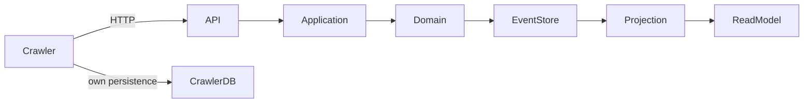

# Veneta Assessments

This repository contains my solution to the Veneta technical assessment.

The assignment was to build a consumer API using **Event Sourcing** for an e-commerce platform, including an independently running API crawler that retrieves and stores consumers separately.

The implementation deliberately stays pragmatic: clear boundaries, explicit code, minimal infrastructure and no abstractions that are not justified by the problem.

At the same time, I used the assessment to demonstrate a broader **platform engineering approach** around the application: local orchestration with .NET Aspire, health/readiness, structured logging, distributed tracing, executable test resources and a repeatable development workflow supported by agent skills.

---

# Assessment

The assignment required an API that supports:

* Create a consumer
* Update first and last name
* Update address
* Retrieve a single consumer
* Retrieve all consumers
* Automated tests

In addition, a **separate solution** had to retrieve all consumers from the platform and store them independently.

The main technical requirement was to use **Event Sourcing**.

---

# Approach

I started by reducing the assignment to its actual requirements rather than immediately selecting frameworks or introducing architectural patterns.

The main principles were:

1. **Keep Event Sourcing real and explicit**
2. **Keep the domain independent from infrastructure and HTTP**
3. **Keep the read model disposable and rebuildable**
4. **Keep the crawler completely independent from the backend**
5. **Use KISS as the default**
6. **Add platform capabilities where they provide concrete value**

The result is a small modular backend, a separate crawler application and a lightweight local development platform around them.

The original assessment-oriented project naming was intentionally retained where practical. I did not restructure the repository simply to impose a different naming convention; the important thing is that the architectural boundaries remain clear.

---

# Architecture



## Backend

The backend follows this flow:

```text
HTTP request
    ↓
API endpoint
    ↓
Application service
    ↓
Consumer aggregate
    ↓
Domain event
    ↓
NEventStore
    ↓
Projection
    ↓
EF Core read model
```

The **Event Store is authoritative**.

The EF Core read model is a derived representation optimized for queries. It can be deleted and rebuilt from the event history.

## Crawler

The crawler is intentionally a separate application.

It:

* communicates with the backend only through HTTP;
* knows nothing about the backend Event Store;
* does not reference backend domain classes;
* does not use the backend database;
* owns its own persistence;
* can therefore be treated as an external consumer of the API.

The crawler is not a backend module.

---

# Event Sourcing

The `Consumer` is the Aggregate Root.

The domain currently uses three explicit events:

```text
ConsumerCreated
ConsumerNameChanged
ConsumerAddressChanged
```

Commands express intent:

```text
CreateConsumer
ChangeConsumerName
ChangeConsumerAddress
```

The aggregate applies events to rebuild its state.

For example:

```text
ConsumerCreated
    ↓
ConsumerNameChanged
    ↓
ConsumerAddressChanged
```

The current consumer state is therefore a projection of its event history rather than the primary source of truth.

The aggregate contains the business rules. Event application only changes state; it does not make new business decisions.

---

# Why NEventStore?

NEventStore was already part of the supplied assessment direction and provides the Event Sourcing primitives required here without building a custom Event Store framework.

It provides:

* event streams;
* persistence;
* serialization;
* optimistic concurrency.

I kept NEventStore usage explicit rather than wrapping it in a generic Event Sourcing framework.

For a small assessment with one aggregate, explicit code is easier to understand, easier to review and easier to reason about.

---

# Persistence

SQLite is used to keep the assessment self-contained and easy to run locally.

There are three logically separate stores:

```text
Data/
├── backend-eventstore.sqlite
├── backend-readmodel.sqlite
└── crawler.sqlite
```

## Event Store

`backend-eventstore.sqlite` contains the authoritative event history.

## Read model

`backend-readmodel.sqlite` contains the derived query model.

It is deliberately treated as disposable state. If necessary it can be deleted and rebuilt from the Event Store.

## Crawler database

`crawler.sqlite` belongs exclusively to the crawler.

There is no shared persistence between crawler and backend.

---

# Concurrency

Updates use an `expectedVersion`.

The client supplies the version it based its change on.

The application performs an early version check for useful feedback, while the final atomic Event Store commit is the actual concurrency boundary.

For example:

```text
Current stream version: 3

Client A expects: 3
Client B expects: 3

A commits successfully → version 4
B attempts commit      → concurrency conflict
```

The second update results in `409 Conflict` instead of silently overwriting the first update.

---

# Read Model and Projection

The read model is not another source of truth.

Normal processing is:

```text
New event commit
    ↓
Projection
    ↓
Read model update
```

The projector tracks the stream version.

When a read-model entry is missing or its version is no longer contiguous, the corresponding consumer stream can be replayed.

A complete rebuild can also replay all committed consumer events.

This gives the system an important property:

> If the read model is lost or corrupted, it can be recreated from the Event Store.

The Event Store therefore remains the authoritative state while the read model can remain optimized for query performance.

---

# API

The API exposes the required consumer operations:

```text
POST /consumers
PUT  /consumers/{id}/name
PUT  /consumers/{id}/address
GET  /consumers/{id}
GET  /consumers
```

The API layer remains intentionally thin.

HTTP concerns are handled at the endpoint boundary, application orchestration remains in the application layer and business rules remain in the domain.

---

# API Crawler

The crawler is a standalone, one-shot console application.

It retrieves consumers using the paginated API:

```text
GET /consumers?offset=0&limit=100
GET /consumers?offset=100&limit=100
GET /consumers?offset=200&limit=100
...
```

It validates the pagination contract and protects against inconsistent API responses.

Transient failures are retried, including:

* network failures;
* HTTP 429;
* HTTP 5xx.

Retries use exponential backoff and jitter, with support for `Retry-After`.

Permanent client errors are not blindly retried.

Crawler storage is idempotent: consumers are upserted by their ID and stale data does not overwrite a newer local version.

The crawler can be run independently of Aspire and communicates with the backend solely through its HTTP API.

---

# Platform Engineering

The core assessment is an Event Sourcing API. I deliberately kept that core small.

Around it, I added a limited amount of platform engineering to demonstrate how I approach the complete developer and runtime experience.

This includes:

* .NET Aspire for local orchestration;
* health/readiness checks;
* structured logging;
* distributed tracing through OpenTelemetry;
* visibility into API, Event Store, projection and crawler activity;
* executable test projects as Aspire resources;
* repeatable local development workflows;
* shared VS Code and Rider launch configurations;
* agent-assisted development workflows and repository-specific engineering rules.

The intention was not to turn the assessment into a platform project.

The intention was to show that the application can be developed, tested and observed as a small system without complicating the business architecture.

---

# Aspire

Aspire was deliberately added even though it was not required by the assignment.

It provides a useful local representation of the system:

```text
consumer-api
    │
    ├── Event Store
    ├── Read Model
    └── readiness

consumer-crawler
    │
    └── HTTP → consumer-api

api-scenario
backend-tests
crawler-tests
```

Aspire provides a convenient place to:

* start the services;
* inspect service status;
* run the crawler;
* execute tests;
* inspect traces and logs;
* validate the complete local flow.

Aspire is **development orchestration only**.

The architecture does not depend on Aspire at runtime.

The backend and crawler remain independently executable applications.

---

# Observability

Observability was treated as part of the implementation rather than something to add afterwards.

The important paths through the system can be followed through traces.

For the backend:

```text
HTTP request
    ↓
Application operation
    ↓
Event Store
    ↓
Projection
    ↓
Read Model
```

For the crawler:

```text
Crawler
    ↓
HTTP request
    ↓
API response
    ↓
Validation
    ↓
Local persistence
```

The traces make it possible to follow behaviour across application boundaries rather than only looking at individual console messages.

Backend telemetry includes the relevant API, Event Store and projection activities.

Payload capture is restricted to development scenarios so request data is not automatically exported in environments where that would be inappropriate.

---

# Test Projects as System Components

The automated tests are not only executable through `dotnet test`.

The backend and crawler test projects are also exposed as explicit one-shot resources in the Aspire environment.

This makes the test suite part of the development workflow:

```text
backend-tests
crawler-tests
```

The API scenario is also available as a runnable development resource and exercises the important end-to-end paths, including:

* health/readiness;
* pagination;
* consumer creation;
* reads;
* name and address updates;
* stale concurrency;
* missing consumers;
* invalid pagination.

The goal is to make the system easy to verify as a whole rather than only as isolated classes.

---

# Engineering Workflow

I used the assessment as an opportunity to apply a structured engineering workflow.

The repository contains:

* `AGENTS.md` with project-specific engineering rules;
* assessment specification and implementation planning documents;
* agent skills for repeatable development workflows;
* explicit constraints around architecture and KISS.

The effective workflow was:

```text
Understand
    ↓
Analyse
    ↓
Define architecture and constraints
    ↓
Implement
    ↓
Test
    ↓
Review
    ↓
Harden
    ↓
Document
```

Agent tooling was used as an engineering aid, not as a replacement for architectural decisions.

The repository rules intentionally reinforce the important boundaries:

* Event Store remains authoritative;
* read model remains rebuildable;
* crawler remains independent;
* domain remains infrastructure-agnostic;
* unnecessary abstractions are avoided.

---

# Assessment Journey

## 1. Start with the requirements

The first step was to identify what the assessment actually required and what it did not.

The most important observation was that Event Sourcing was a core requirement rather than an optional implementation detail.

That led directly to the decision to make the Event Store authoritative and the read model derived.

---

## 2. Keep the architecture small

A four-hour Event Sourcing assignment can easily turn into a framework-building exercise.

I deliberately avoided that.

There is no:

* MediatR;
* generic repository;
* generic aggregate framework;
* generic event bus;
* message broker;
* Redis;
* snapshot system;
* microservice split.

Those technologies can all be useful in the right context, but none was required to solve this problem.

The rule was simple:

> Add an abstraction only when the problem gives it a concrete reason to exist.

---

## 3. Build the domain first

The Consumer aggregate became the centre of the design.

The domain defines:

* what a valid Consumer is;
* which changes are allowed;
* which events represent those changes;
* how state is reconstructed from history.

This keeps persistence and HTTP concerns outside the business model.

---

## 4. Make Event Sourcing persistent

The next step was connecting the aggregate to NEventStore and SQLite.

The important test was not simply:

> Can an event be saved?

It was:

> Can the application restart and reconstruct the Consumer entirely from the event history?

That distinction separates an actual Event Sourcing implementation from an in-memory demonstration.

---

## 5. Add the read model

Replaying an event stream for every GET request would make querying unnecessarily expensive.

The solution therefore projects committed events into an EF Core read model.

This keeps reads simple and efficient while preserving the Event Store as the source of truth.

---

## 6. Add optimistic concurrency

Once concurrent writers are possible, stream version becomes important.

The API therefore exposes an expected version for updates and the Event Store enforces the final atomic concurrency boundary.

This makes concurrent updates deterministic rather than allowing silent overwrites.

---

## 7. Build the crawler as an external client

The crawler was deliberately implemented as a separate solution.

It only knows the HTTP contract.

Its own model and persistence are independent from the backend implementation.

I then treated it like a real external client and considered:

* pagination;
* retries;
* transient failures;
* duplicate responses;
* inconsistent page metadata;
* idempotent writes;
* stale updates.

---

## 8. Add platform engineering around the application

Once the functional core was complete, I used Aspire to make the system easier to run and inspect locally.

I added:

* service orchestration;
* readiness;
* logging;
* tracing;
* runnable test resources;
* a runnable API scenario;
* consistent local launch configurations.

This was deliberately kept outside the business architecture.

The result is that the Event Sourcing implementation remains small while the overall developer experience is closer to how I would approach a real platform.

---

## 9. Harden and verify

The final phase focused on verification instead of adding features.

That included:

* domain tests;
* Event Store integration tests;
* API integration tests;
* crawler tests;
* concurrency behaviour;
* projection rebuild behaviour;
* local runtime configuration;
* database locations;
* documentation;
* repository hygiene.

The final implementation therefore reflects two priorities:

**correctness of the assessment requirements** and **quality of the surrounding engineering experience**.

---

# Design Choices and Non-Goals

The following choices are intentional:

| Area                  | Decision                                     |
| --------------------- | -------------------------------------------- |
| Architecture          | Small modular monolith                       |
| Event Sourcing        | Explicit aggregate and events                |
| Event Store           | NEventStore                                  |
| Event persistence     | SQLite                                       |
| Read model            | EF Core + SQLite                             |
| Crawler persistence   | EF Core + SQLite                             |
| API                   | ASP.NET Core                                 |
| Concurrency           | Expected version + atomic Event Store commit |
| Projection            | Rebuildable derived state                    |
| Crawler communication | HTTP only                                    |
| Orchestration         | .NET Aspire                                  |
| Observability         | OpenTelemetry + structured logging           |
| Testing               | Unit + integration + crawler tests           |
| Development workflow  | AGENTS.md + agent skills                     |

Intentionally not included:

* MediatR;
* generic repositories;
* generic Event Sourcing infrastructure;
* generic event bus;
* message brokers;
* Redis;
* snapshots;
* authentication/authorization;
* microservice redesign.

These are not necessarily bad technologies. They are simply outside the scope of this assessment.

---

# What I Would Change for Production

This implementation is deliberately scoped to the assessment.

For a production system I would reconsider several choices depending on scale and operational requirements.

Examples include:

* centralized/shared production persistence instead of local SQLite;
* stronger event schema and version management;
* event upcasting and compatibility strategy;
* asynchronous projection infrastructure where eventual consistency is acceptable;
* operational monitoring and alerting;
* authentication and authorization;
* stronger recovery tooling;
* snapshots if event streams become large;
* production deployment and scaling strategy.

Those concerns are intentionally not implemented here because they are not necessary to demonstrate the required Event Sourcing solution.

---

# Repository Structure

The project naming stays close to the supplied assessment repository while keeping the boundaries explicit:

```text
Veneta.Assessments/
├── Veneta.Assessments.Backend/
│   ├── Veneta.Assessments.Backend.slnx
│   ├── Veneta.Assessments.Backend.ConsumerService/
│   └── Veneta.Assessments.Backend.ConsumerService.Tests/
│
├── Veneta.Assessments.Crawler/
│   ├── Veneta.Assessments.Crawler.slnx
│   ├── Veneta.Assessments.Crawler/
│   └── Veneta.Assessments.Crawler.Tests/
│
├── Veneta.Assessments.AppHost/
│   ├── Veneta.Assessments.AppHost.slnx
│   ├── Veneta.Assessments.AppHost/
│   └── ApiScenario/
│
├── Data/
├── docs/
├── AGENTS.md
└── Veneta.Assessments.slnx
```

The important architectural distinction is:

```text
Backend
    owns Event Store and Read Model

Crawler
    owns its own storage
    communicates through HTTP only

AppHost
    owns local orchestration only
```

---

# Development Data

When running in `Development`, the backend can seed demo consumers for local exploration.

The default seed allows the crawler and pagination behaviour to be demonstrated over multiple pages.

To reset local state completely:

```bash
rm -f Data/backend-eventstore.sqlite* Data/backend-readmodel.sqlite* Data/crawler.sqlite*
```

The databases are local runtime state and are not intended to be committed to source control.

---

# Build and Test

## Restore

```bash
dotnet restore
```

## Build

```bash
dotnet build Veneta.Assessments.slnx
```

## Test

```bash
dotnet test Veneta.Assessments.slnx
```

The individual test projects can also be executed independently.

---

# Run the Backend

Start the backend directly with:

```bash
dotnet run \
  --project Veneta.Assessments.Backend/Veneta.Assessments.Backend.ConsumerService/Veneta.Assessments.Backend.ConsumerService.csproj
```

The backend creates or uses its SQLite databases under `Data/`.

---

# Run the Crawler

Start the backend first, then run:

```bash
dotnet run \
  --project Veneta.Assessments.Crawler/Veneta.Assessments.Crawler/Veneta.Assessments.Crawler.csproj
```

The crawler can be configured through:

```text
Crawler:ApiBaseUrl
Crawler:DatabasePath
Crawler:PageSize
```

Configuration can be supplied through JSON or environment variables.

---

# Run with Aspire

Start the AppHost with:

```bash
dotnet run \
  --project Veneta.Assessments.AppHost/Veneta.Assessments.AppHost/Veneta.Assessments.AppHost.csproj
```

From the Aspire dashboard you can inspect:

* `consumer-api`;
* `consumer-crawler`;
* `api-scenario`;
* `backend-tests`;
* `crawler-tests`.

The crawler is exposed as a one-shot resource and remains independently executable.

---

# Summary

The implementation can be reduced to a few principles:

```text
Event Store = truth
Domain      = business rules
Projection  = derived state
Read Model  = query model
Crawler     = independent HTTP client
SQLite      = self-contained assessment persistence
Aspire      = development platform
Telemetry   = observable behaviour
Tests       = executable confidence
KISS        = guiding principle
```

The goal was not to demonstrate how many architectural patterns or technologies could be applied.

The goal was to build a clear and correct Event Sourcing solution, keep its boundaries explicit, and demonstrate the broader engineering practices I would bring to a real platform: **observability, testability, developer experience, operational thinking and automation without unnecessary complexity**.
